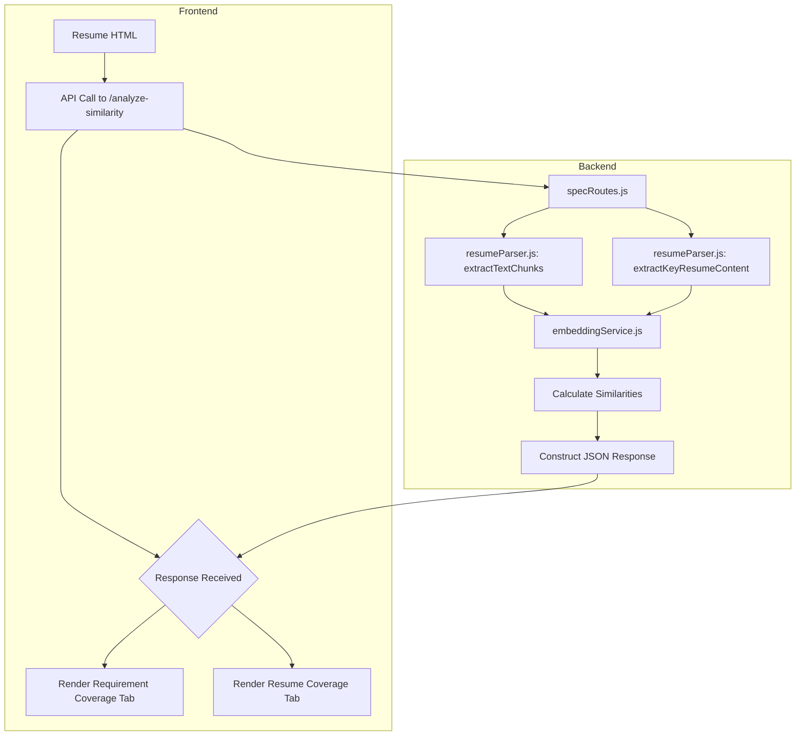
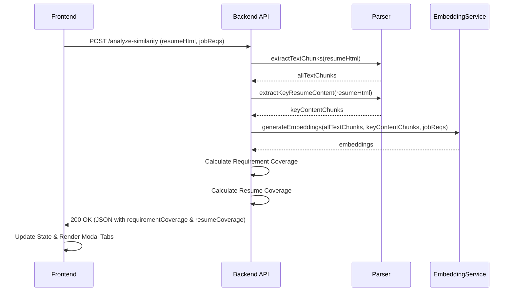

# Architectural Plan: Resume and Requirement Coverage Analysis

### 1. Project Goal

The primary objective is to refactor the resume analysis feature to provide more targeted and actionable feedback. This involves two main changes:

1.  **Splitting the Analysis**: The current single analysis will be split into two distinct parts:
    *   **Requirement Coverage**: Measures how well the job description's requirements are covered in the resume. (This remains unchanged).
    *   **Resume Coverage**: A new analysis that evaluates every key piece of content in the resume (specifically bullet points and summary sentences) and scores its relevance against the job description.
2.  **Improving the UI**: The "Unaligned Content" tab in the analytics modal will be renamed to "Resume Coverage" and updated to display the results of this new, more detailed analysis.

### 2. High-Level Architectural Plan

The architecture will be updated to support two parallel analysis paths within the existing `/analyze-similarity` endpoint. This will be achieved by creating a new, specialized content extraction function on the backend, leaving the existing logic intact for the "Requirement Coverage" analysis. The frontend will be updated to consume and display this new data structure under a renamed tab.

This approach minimizes risk by isolating the new logic and reusing existing infrastructure like the embedding service and similarity calculations.

### 3. Component-Level Changes

#### 3.1. Backend Modifications

**File: `backend/src/utils/resumeParser.js`**

1.  **Create New Function `extractKeyResumeContent`**: A new function will be added to specifically extract bullet points and summary sentences.
    *   **Bullet Point Extraction**: It will find all `<li>` elements and any text nodes starting with `*`, `•`, or `-`.
    *   **Summary Sentence Extraction**: It will identify text within `<p>` tags that are not part of a larger list structure. It will then apply the following filters to avoid noise:
        *   **Exclusion Rules**: Discard text matching patterns for dates, contact info (email, phone), or locations.
        *   **Length Constraints**: Text must be between 15 and 300 characters.
        *   **Sentence Structure**: Text must be a complete sentence.
        *   **Case Normalization**: Discard text in ALL CAPS.
2.  **Preserve Existing Function `extractTextChunks`**: This function will be kept as is to continue powering the "Requirement Coverage" analysis without any changes.

**File: `backend/src/api/routes/specRoutes.js`**

1.  **Modify `/analyze-similarity` Endpoint**: This endpoint will be updated to perform both analyses.
    *   It will call `extractTextChunks` for the requirement coverage analysis.
    *   It will call the new `extractKeyResumeContent` for the resume coverage analysis.
    *   The final JSON response will be updated to have two keys: `requirementCoverage` and `resumeCoverage`.
    *   The `resumeCoverage` object will be an array where each item contains the `resume_chunk` (the bullet or summary) and its `score`.

#### 3.2. Frontend Modifications

**File: `frontend/src/components/Analytics/AnalyticsModal.tsx`**

1.  **Rename Tab**: The tab label will be changed from "Unaligned Content" to "Resume Coverage".
2.  **Update Rendering Logic**: The `TabPanel` for the renamed tab will be modified to:
    *   Iterate over the new `analysis.resumeCoverage` array.
    *   Display every item returned from the backend, regardless of its score.
    *   Show the `resume_chunk` (the bullet point or summary sentence).
    *   Display the `formatScore(item.score)` next to each chunk.
3.  **Update Type Definitions**: The `BidirectionalAnalysis` and `UnalignedContent` interfaces will be updated to reflect the new data structure. `unalignedContent` will be renamed to `resumeCoverage`.

```typescript
// In frontend/src/components/Analytics/AnalyticsModal.tsx

interface ResumeCoverageItem { // Renamed from UnalignedContent
  resume_chunk: string;
  score: number;
}

interface BidirectionalAnalysis {
  requirementCoverage: RequirementCoverage[];
  resumeCoverage: ResumeCoverageItem[]; // Renamed from unalignedContent
}
```

### 4. Data Flow and Sequence

#### 4.1. Data Flow Diagram



#### 4.2. Sequence Diagram



### 5. Implementation & Testing Strategy

*   **Phase 1: Backend Development**: Implement the `extractKeyResumeContent` function and update the `/analyze-similarity` endpoint. Unit tests will be crucial for the new parser to ensure it correctly identifies content and filters noise.
*   **Phase 2: Frontend Development**: Update the `AnalyticsModal.tsx` component to rename the tab and render the new `resumeCoverage` data.
*   **Testing**:
    *   **Unit Tests**: For the `extractKeyResumeContent` function with various HTML structures to test edge cases.
    *   **Integration Tests**: For the `/analyze-similarity` endpoint to ensure the final JSON structure is correct.
    *   **End-to-End Tests**: Manually test the entire flow with different resumes and job descriptions to validate that the UI displays the correct information.