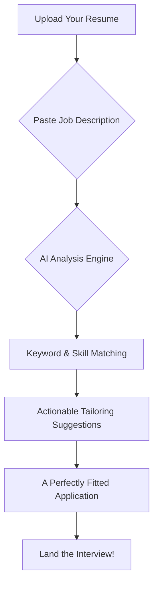

# App Name: Tailr

## Core Concept:

Tailr is an intelligent career assistant that transforms the generic, one-size-fits-all resume into a perfectly fitted, bespoke application for every job opportunity. It acts as a personal career stylist, ensuring that every resume a user sends is meticulously crafted to meet the specific requirements of a job, dramatically increasing the chances of landing an interview.

## Intended Goal:

The primary goal of Tailr is to empower job seekers to stop applying with generic documents and start competing with precision-engineered applications. We aim to demystify what recruiters are looking for by using AI to analyze job descriptions and provide actionable, data-driven insights. This saves users time, reduces the frustration of the job hunt, and gives them the confidence that their application is a perfect fit for the role.

---

# Detailed Description for a Landing Page

**(Headline)**
### Stop Blending In. Start Standing Out.

**(Sub-headline)**
### Tailr is your personal AI career stylist, crafting perfectly fitted resumes that land interviews. In a sea of generic applications, we make sure yours is the one they can't ignore.

---

**(Section 1: The Problem)**
### Your Resume is Your First Impression. Make it Count.

The average recruiter spends just **7 seconds** scanning a resume. In that time, they're not just looking for experience; they're looking for a perfect match. A generic, one-size-fits-all resume rarely makes the cut. It speaks to no one because it tries to speak to everyone. The result? Your qualifications get overlooked, and your application ends up in the "no" pile.

---

**(Section 2: The Solution - Introducing Tailr)**
### Bespoke Resumes, Intelligently Crafted.

Tailr is here to change the game. We've built a powerful AI platform that treats every job application like a custom suit fitting. Our technology deconstructs job descriptions to understand their unique DNA—the keywords, skills, and qualifications that matter most. Then, it guides you in tailoring your resume to match, ensuring you present yourself as the ideal candidate, every single time.

---

**(Section 3: Core Features)**

*   **The Perfect Measurement: AI-Powered Job Analysis**
    *   Our AI reads between the lines. Just provide a job description, and Tailr instantly identifies critical skills, keywords, and qualifications. It's like having a cheat sheet for what the hiring manager wants to see.

*   **Masterful Tailoring: Intelligent Resume Optimization**
    *   This is where the magic happens. Tailr provides a side-by-side comparison of the job requirements and your resume, offering clear, actionable suggestions. It tells you what to highlight, which words to use, and how to frame your experience to create a seamless fit.

*   **Your Career Wardrobe: A Smart Application Dashboard**
    *   Say goodbye to cluttered folders and confusing spreadsheets. Tailr provides an elegant dashboard to manage all your applications. Track their status, store every tailored resume version, and maintain a clear overview of your job-seeking journey.

---

**(Section 4: The Vision)**
### Apply with Confidence. Interview with Ease.

Our goal is simple: to give you an unfair advantage in the job market. We believe that a great career shouldn't be left to chance. By combining cutting-edge AI with an intuitive, user-focused design, Tailr transforms a tedious process into a strategic advantage.

**With Tailr, you're not just applying for a job—you're making a statement.**